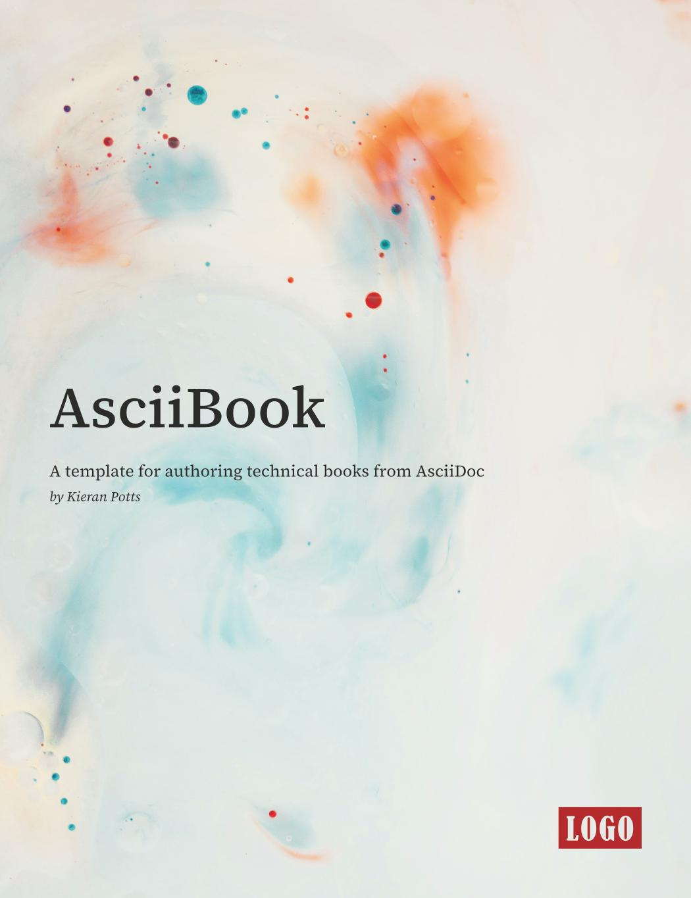

# AsciiBook

This is a template repository for a lightweight toolchain for authoring technical books from AsciiDoc source.

## Features

- AsciiDoc supports formatting that is commonly used in technical books, such as code blocks.
- Uses the official [Asciidoctor Docker](https://hub.docker.com/r/asciidoctor/docker-asciidoctor/) image for compilation.
- No local installation required – just Docker.
- Generate books in PDF, EPUB, and HTML formats.
- Two PDFs generated: one optimized for physical bookbinding, one optimized for screen reading.
- Plus, offer your customers an alternative dark-themed PDF for screen reading.
- Automatic table-of-contents generation.
- Chapters organized in a directory structure.
- Easy theme customization.
- Lots of bundled fonts to choose from.
- Cover image template included.
- Page size aligned to Leanpub's "technical" book format (7in x 9.1in).
- Includes a basic GitHub Actions workflow for automation.

## Documentation

- [Requirements](./docs/requirements.md)
- [Get started](./docs/get-started.md)
- [Source files](./docs/source-files.md)
- [Configuration](./docs/configuration.md)
- [Building](./docs/building.md)
- [Repository settings](./docs/development/repository-settings.md)

## Acknowledgements

This project started as a partial fork of [Liran Tal's AsciiDoc Book Starter](https://github.com/lirantal/asciidoc-book-starter/). [Adrian Kosmaczewski's eBook Template](https://github.com/akosma/eBook-Template/), and [AsciiDoctor PDF's own examples](https://github.com/asciidoctor/asciidoctor-pdf/tree/main/examples), were other sources of inspiration.

-----

Copyright © 2020-present Kieran Potts, [MIT license](./LICENSE.txt)
